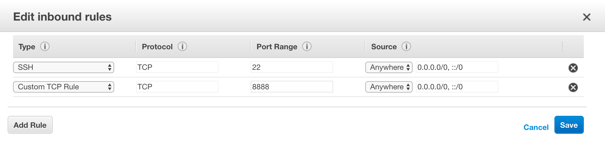

# Deep Learning System Lab1 Notebooks

This repo contains various notebooks that introduces basic usages and training
of deep learning models and applying pretrained state-of-the-art models.

## How to use

### Python

The python notebooks are written in [Jupyter](http://jupyter.org/).

- **Setup** We can run and modify these notebooks if both [mxnet](http://mxnet.io/get_started/index.html#setup-and-installation) and [jupyter](http://jupyter.org/) are
  installed. Here is an [example script](https://gist.github.com/mli/b64322f446b2043e3350ddcbfa5957be) to install all these packages on Ubuntu.

  Intructions to setup on AWS instances to run the notebooks:

  1.  Create an AWS account, and apply the student credit from [AWS Education](https://aws.amazon.com/education/awseducate).

  2.  Launch a g2.2xlarge or p2.2xlarge instance. The [AMI Ids](https://aws.amazon.com/marketplace/pp/B01M0AXXQB) that you can use:

      | AWS Region Name       | Region      | AMI Id         |
      |-----------------------|-------------|----------------|
      | US West (Oregon)      | us-west-2   | `ami-dfb13ebf` |
      | US East (N. Virginia) | us-east-1   | `ami-e7c96af1` |
      | EU (Ireland)          | eu-west-1   | `ami-6e5d6808` |

      Remember to open the TCP port 22 and 8888 in the security group. You can modify the security group after you create the instance.
      Find the Instances page at the EC2 Dashboard, and click the security group of the instance you created, which is at the last column.
      In the Inbound tab, add the SSH rule and customized TCP Rule with port 8888 from anywhere.
      

  3.  Once launch is succeed, setup the following variable with proper value

      ```bash
       export HOSTNAME=ec2-107-22-159-132.compute-1.amazonaws.com
       export PERM=~/Downloads/my.pem
      ```

  4. Now we should be able to ssh to the machine by

      ```bash
        chmod 400 $PERM
        ssh -i $PERM -L 8888:localhost:8888 ec2-user@HOSTNAME
      ```

      Here we forward the EC2 machine's 8888 port into localhost.

  5. Clone this repo on the EC2 machine and run jupyter

      ```bash
        sudo yum install -y graphviz
        git clone https://github.com/dlsys-course/lab1.git
        cd lab1
        jupyter notebook
      ```

  6. Wait until jupyter creates the notebook and copy the URL it outputs to your brower.
   The URL should look like:
   http://localhost:8888/?token=5b870699ac133c42c56400de91f66256b89ab211ee38c7e0
